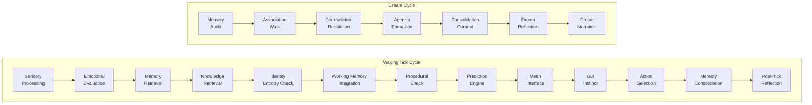

<div align="center">

# LegionIO

### Cognitive architecture for AI agents. Not a prompt wrapper.

**73 extension gems. 234 cognitive modules. 23,000+ specs. 369 repos.**

[](https://www.ruby-lang.org)
[](https://www.apache.org/licenses/LICENSE-2.0)
[](https://github.com/search?q=topic%3Alegionio+org%3ALegionIO&type=repositories)

**[legionio.dev](https://legionio.dev)** | [Getting Started](https://legionio.dev/getting-started/) | [Discussions](https://github.com/LegionIO/docs/discussions)

```bash
gem install legionio
# or
brew tap LegionIO/tap && brew install legionio
```

*Too lazy for prompts. Built a brain instead.*

</div>

---

Most AI agent frameworks give you a loop: prompt, tool call, repeat. LegionIO gives you a **cognitive architecture** — memory that fades, emotions that shift decisions, trust that's earned, predictions that fail and adapt, and agents that dream during idle cycles to consolidate what they've learned.

It's not a wrapper around an LLM. It's a brain built from first principles.

## The Cognitive Stack

Every LegionIO agent runs a **tick cycle** — a 13-phase cognitive loop modeled on biological neural processing. Each tick, the agent perceives, remembers, predicts, decides, acts, and reflects. During idle periods, a 7-phase **dream cycle** consolidates and reorganizes memory.



234 cognitive modules organized into **13 domain gems**, each modeling a distinct aspect of cognition:

| Domain | Modules | What's Happening |
|--------|---------|-----------------|
| **Executive** | 23 | Planning, control, inhibition, working memory, decision-making. Prefrontal cortex model. |
| **Attention** | 24 | Spotlight, switching, salience, gating. Parietal/thalamic filter with signal detection theory. |
| **Memory** | 18 | Encoding, storage, retrieval, consolidation, decay. Hippocampal model with Hebbian assembly. |
| **Affect** | 17 | Emotion, mood, empathy, somatic markers, reward. Limbic system with Russell circumplex model. |
| **Inference** | 27 | Prediction, causation, belief updating. Bayesian brain with Friston's free energy principle. |
| **Social** | 17 | Theory of mind, cooperation, trust, moral reasoning. Mirror neuron model with BDI agents. |
| **Self** | 16 | Metacognition, identity, self-model, narrative, personality. Default mode network with Big Five. |
| **Learning** | 14 | Habit, reinforcement, procedural learning, adaptation. Synaptic plasticity with ACT-R. |
| **Language** | 9 | Inner speech, narrative, frame semantics. Broca's/Wernicke's model with conceptual metaphor. |
| **Imagination** | 17 | Creativity, dreaming, mental simulation, prospection. 8-phase generative dream engine. |
| **Homeostasis** | 20 | Balance, rhythm, energy, fatigue recovery, temporal perception. EEG-band oscillators. |
| **Defense** | 15 | Bias detection, error monitoring, immune response. Cognitive immune system with ACC model. |
| **Integration** | 17 | Cross-modal binding, coherence, synthesis. Global Workspace Theory implementation. |

> Every module is optional. They compose. They interact. Drop one and the rest adapt.

## GAIA: The Coordination Layer

**GAIA** (General Agentic Intelligence Architecture) orchestrates the tick cycle, routes messages between cognitive modules, and manages the channel abstraction that connects perception to action.

Think of it as the thalamus — not doing the thinking, but making sure the right signals reach the right place at the right time.

| Tick Mode | Budget | Phases | Use Case |
|-----------|--------|--------|----------|
| Dormant | 0.2s | Memory consolidation only | Deep sleep |
| Dormant Active | Uncapped | 8 dream phases | Idle consolidation |
| Sentinel | 0.5s | 5 phases (sense + predict + consolidate) | Low-power monitoring |
| Full Active | 5.0s | All 13 phases | Active cognition |

## Synapse: Three-Layer Cognitive Routing

**Synapse** models the nervous system between task execution and cognition:

| Layer | Component | Role |
|-------|-----------|------|
| **Bones** | lex-tasker | Raw task execution and chaining |
| **Nerves** | lex-synapse | Confidence-scored routing, autonomy levels, auto-revert on failure |
| **Mind** | GAIA + Apollo | Dream replay, knowledge promotion, shared memory |

Autonomy scales with confidence: **Observe** (0-0.3) &rarr; **Filter** (0.3-0.6) &rarr; **Transform** (0.6-0.8) &rarr; **Autonomous** (0.8-1.0). Three consecutive failures trigger auto-revert.

## Apollo: Shared Knowledge Store

**Apollo** is the shared durable knowledge layer for the cognitive mesh. Backed by PostgreSQL with pgvector, it provides:

- **Confidence decay**: Knowledge starts at 0.5, strengthened by corroboration, weakened by time
- **Semantic retrieval**: Cosine similarity search over 1536-dimensional embeddings
- **Cross-agent sharing**: Agents interact via RabbitMQ only — no direct DB access
- **Knowledge lifecycle**: candidate &rarr; confirmed &rarr; decayed &rarr; archived

## The Job Engine Underneath

All of this cognition runs on a production-grade async job engine:

- **RabbitMQ** message broker with priority queues and dead-letter exchanges
- **Task chaining** — `Task A -> [transform] -> Task B -> [condition] -> Task C`
- **Extension auto-discovery** — drop a `lex-*` gem in your Gemfile and it's live
- **5 actor types** — subscription, polling, interval, one-shot, loop
- **Distributed scheduling** with cron expressions and interval locking
- **HashiCorp Vault** for secrets, dynamic credentials, PKI, and JWT
- **Multi-database** support — SQLite, PostgreSQL, MySQL via Sequel
- **Two-tier caching** — Redis/Memcached with local fallback
- **RBAC** — Vault-style flat policies for fine-grained access control
- **Transport spool** — JSONL disk buffer when AMQP is unavailable (72hr retention)

## Four Ways In

```bash
# CLI — 60+ commands, every one supports --json
legion start
legion task run http.request.get url:https://example.com
legion lex list
legion dashboard

# Interactive AI Chat (built-in agentic REPL)
legion chat
legion chat prompt "analyze this codebase"

# REST API (Sinatra + Puma)
curl http://localhost:4567/api/v1/tasks

# MCP Server (Model Context Protocol) — plug Legion into any AI agent
legion mcp
```

### CLI Highlights

| Command | What It Does |
|---------|-------------|
| `legion chat` | AI-powered REPL with tool use, memory, subagents, and slash commands |
| `legion plan` | Read-only exploration mode — investigate without changing anything |
| `legion swarm` | Multi-agent workflow orchestration from workflow definitions |
| `legion commit` / `legion pr` | AI-generated commit messages and PR descriptions |
| `legion review` | AI code review with severity levels |
| `legion doctor` | Diagnose your environment with auto-fix suggestions |
| `legion dashboard` | TUI operational dashboard with live refresh |
| `legion coldstart` | Bootstrap agent memory from CLAUDE.md and documentation |
| `legion marketplace` | Search, install, and publish extensions |

## LLM Integration

LegionIO isn't competing with LLMs — it gives them a body.

| Component | What It Does |
|-----------|-------------|
| **legion-llm** | Core LLM layer — chat, embeddings, tool use, agents. Routes across Bedrock, Anthropic, OpenAI, Gemini, Ollama. Three-tier model escalation: local &rarr; fleet &rarr; cloud |
| **legion-mcp** | MCP server with Tier 0 routing — observe tool patterns, learn, compress context, bypass LLM for routine operations |
| **lex-claude** | Claude API — messages, models, batches, token counting |
| **lex-openai** | OpenAI API — chat, images, audio, embeddings, files, moderations |
| **lex-gemini** | Gemini API — content generation, embeddings, files, caching |

Credentials resolve through a universal secret resolver: `vault://path#key`, `env://VAR_NAME`, or plain strings — with fallback chains.

## Architecture

```
                          ┌──────────────────────────────────────┐
                          │           LegionIO v1.4.74           │
                          │   CLI  /  REST API  /  MCP  / Chat   │
                          └──────────────────┬───────────────────┘
                                             │
              ┌──────────┬──────────┬────────┼────────┬──────────┬──────────┐
              │          │          │        │        │          │          │
          transport    crypt      data     cache   settings     llm       gaia
          (RabbitMQ)  (Vault)   (Sequel)  (Redis)  (config)  (ruby_llm)  (tick)
              │          │          │        │        │          │          │
              └──────────┴──────────┴────────┼────────┴──────────┴──────────┘
                                             │
                  ┌──────────────────────────┼──────────────────────────┐
                  │                          │                          │
           18 Core LEXs             13 Cognitive Domains         29 Service LEXs
         (tasker, synapse,          (234 sub-modules:          (slack, redis, http,
          scheduler, node,          memory, emotion,             ssh, s3, vault,
          conditioner...)           trust, prediction...)        github, chef...)
```

## Core Libraries

| Library | Version | Purpose |
|---------|---------|---------|
| legion-transport | 1.2.2 | RabbitMQ AMQP messaging |
| legion-crypt | 1.4.4 | Encryption, Vault, JWT, multi-cluster Vault |
| legion-data | 1.4.4 | Database persistence (SQLite/PostgreSQL/MySQL) |
| legion-cache | 1.3.0 | Caching (Redis/Memcached) |
| legion-settings | 1.3.4 | Config management, schema validation, secret resolver |
| legion-llm | 0.3.7 | LLM integration with tiered routing |
| legion-gaia | 0.9.2 | Cognitive coordination (tick cycle, channels) |
| legion-mcp | 0.1.0 | MCP server with Tier 0 behavioral intelligence |
| legion-rbac | 0.2.2 | Role-based access control |
| legion-tty | 0.4.18 | Terminal UI (prompts, tables, spinners, onboarding) |
| legion-logging | 1.2.5 | Console + structured JSON + SIEM export |
| legion-json | 1.2.0 | JSON serialization (multi_json) |

## Navigate the Ecosystem

| Filter | What You Get |
|--------|-------------|
| [`legionio`](https://github.com/search?q=topic%3Alegionio+org%3ALegionIO&type=repositories) | Everything |
| [`legion-core`](https://github.com/search?q=topic%3Allegion-core+org%3ALegionIO&type=repositories) | Core libraries (transport, crypt, data, cache, settings, logging, json, llm, gaia) |
| [`ai`](https://github.com/search?q=topic%3Aai+org%3ALegionIO&type=repositories) | AI/cognitive extensions + LLM integrations |
| [`multi-agent`](https://github.com/search?q=topic%3Amulti-agent+org%3ALegionIO&type=repositories) | Swarm and mesh coordination |
| [`legion-extension`](https://github.com/search?q=topic%3Allegion-extension+org%3ALegionIO&type=repositories) | All extensions |
| [`legion-builtin`](https://github.com/search?q=topic%3Allegion-builtin+org%3ALegionIO&type=repositories) | Built-in extensions (cognitive + operational) |
| [`datastore`](https://github.com/search?q=topic%3Adatastore+org%3ALegionIO&type=repositories) | Redis, Elasticsearch, InfluxDB, S3, Memcached |
| [`notifications`](https://github.com/search?q=topic%3Anotifications+org%3ALegionIO&type=repositories) | Slack, SMS, email, push |
| [`infrastructure`](https://github.com/search?q=topic%3Ainfrastructure+org%3ALegionIO&type=repositories) | SSH, HTTP, Chef, GitHub, TFE |
| [`smart-home`](https://github.com/search?q=topic%3Asmart-home+org%3ALegionIO&type=repositories) | Smart home integrations |
| [`monitoring`](https://github.com/search?q=topic%3Amonitoring+org%3ALegionIO&type=repositories) | Health, ping, PagerDuty |

## Quick Start

```bash
# Install via Homebrew (recommended)
brew tap LegionIO/tap
brew install legion

# Or via RubyGems
gem install legionio

# Start the engine
legion start

# Scaffold a new extension in 10 seconds
legion lex create my_extension
legion generate runner my_runner
legion generate actor my_actor

# Or just start chatting
legion chat
```

## Requirements

- Ruby >= 3.4
- RabbitMQ (AMQP 0.9.1)
- Optional: PostgreSQL/MySQL/SQLite, Redis/Memcached, HashiCorp Vault

## License

Core framework: [Apache-2.0](https://www.apache.org/licenses/LICENSE-2.0) | Extensions: [MIT](https://opensource.org/licenses/MIT)

---

<div align="center">

**Built by [Matthew Iverson](https://github.com/Esity)**

*Agents that think, not just execute.*

</div>
