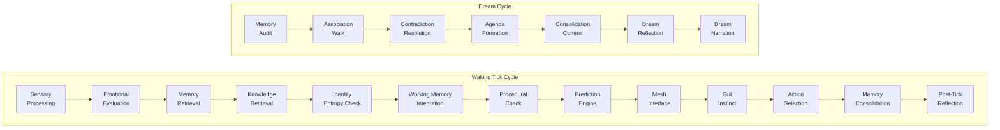

<div align="center">

# LegionIO

### What if your AI agent had a brain — not just a prompt?

**284 extensions. 243 cognitive modules. One Ruby framework.**

[](https://www.ruby-lang.org)
[](https://www.apache.org/licenses/LICENSE-2.0)
[](https://github.com/search?q=topic%3Alegionio+org%3ALegionIO&type=repositories)

</div>

---

Most AI agent frameworks give you a loop: prompt, tool call, repeat. LegionIO gives you a **cognitive architecture** — memory that fades, emotions that shift decisions, trust that's earned, predictions that fail and adapt, and agents that dream during idle cycles to consolidate what they've learned.

It's not a wrapper around an LLM. It's a brain built from first principles.

## The Cognitive Stack

Every LegionIO agent runs a **tick cycle** — a 13-phase cognitive loop modeled on biological neural processing. Each tick, the agent perceives, remembers, predicts, decides, acts, and reflects. During idle periods, a 7-phase **dream cycle** consolidates and reorganizes memory.



This isn't theoretical. It's 243 working extensions:

| Layer | Extensions | What's Happening |
|-------|-----------|-----------------|
| **Perception** | attention, salience, sensory-filter, global-workspace | Raw input becomes weighted, filtered awareness |
| **Memory** | memory, working-memory, consolidation, dream, forgetting | Traces form, strengthen with use, decay naturally. Dream cycles compress and reorganize during idle |
| **Emotion** | emotion, mood, curiosity, surprise, aesthetic | Multi-dimensional affect that *biases decisions* — not sentiment labels, emergent influence |
| **Prediction** | prediction, anticipation, mental-simulation | Forward models with 4 reasoning modes. Agents plan ahead, detect prediction errors, and adapt |
| **Identity** | identity, self-model, theory-of-mind, coldstart | Models of self, the human partner, and other agents. Bootstraps from zero via imprint windows |
| **Social** | trust, consent, conflict, governance, extinction | Trust earned per-domain over time. Four-tier consent gradient. Ethical guardrails that scale |
| **Knowledge** | apollo, reflection, metacognition, insight | Shared knowledge store with confidence decay, corroboration, and cross-agent retrieval |
| **Coordination** | swarm, mesh, swarm-github | Multi-agent teams with charters, roles, and peer-to-peer communication |

> **243 cognitive extensions** — from `lex-attention` to `lex-working-memory` — each implementing a discrete aspect of cognition. They compose. They interact. They're all optional.

## GAIA: The Coordination Layer

**GAIA** (General Agentic Intelligence Architecture) is the cognitive coordinator that orchestrates the tick cycle, routes messages between cognitive modules, and manages the channel abstraction that connects perception to action.

Think of it as the thalamus — not doing the thinking, but making sure the right signals reach the right place at the right time.

## The Job Engine Underneath

All of this cognition runs on a production-grade async job engine:

- **RabbitMQ** message broker with priority queues and dead-letter exchanges
- **Task chaining** — `Task A → [transform] → Task B → [condition] → Task C`
- **Extension auto-discovery** — drop a `lex-*` gem in your Gemfile and it's live
- **5 actor types** — subscription, polling, interval, one-shot, loop
- **Distributed scheduling** with cron expressions and interval locking
- **HashiCorp Vault** for secrets, dynamic credentials, PKI, and JWT
- **Multi-database** support — SQLite, PostgreSQL, MySQL via Sequel
- **Two-tier caching** — Redis/Memcached with local fallback
- **RBAC** — Vault-style flat policies for fine-grained access control

## Three Ways In

```bash
# CLI — every command supports --json
legion start
legion task run http.request.get url:https://example.com
legion lex list
legion lex create myextension

# REST API (Sinatra)
curl http://localhost:4567/api/v1/tasks

# MCP Server (Model Context Protocol) — plug Legion into any AI agent
legion mcp
```

## LLM Integration

LegionIO isn't competing with LLMs — it gives them a body.

| Component | What It Does |
|-----------|-------------|
| **legion-llm** | Core LLM layer — chat, embeddings, tool use, agents. Routes across Bedrock, Anthropic, OpenAI, Gemini, Ollama. Three-tier model escalation: local → fleet → cloud |
| **lex-claude** | Claude API — messages, models, batches, token counting |
| **lex-openai** | OpenAI API — chat, images, audio, embeddings, files, moderations |
| **lex-gemini** | Gemini API — content generation, embeddings, files, caching |

Credentials resolve through a universal secret resolver: `vault://path#key`, `env://VAR_NAME`, or plain strings — with fallback chains.

## Architecture

```
                          ┌──────────────────────────────────────┐
                          │          LegionIO v1.4.29            │
                          │      CLI  /  REST API  /  MCP        │
                          └──────────────────┬───────────────────┘
                                             │
              ┌──────────┬──────────┬────────┼────────┬──────────┬──────────┐
              │          │          │        │        │          │          │
          transport    crypt      data    cache    settings    llm       gaia
          (RabbitMQ)  (Vault)  (Sequel)  (Redis)  (config)  (ruby_llm) (tick)
              │          │          │        │        │          │          │
              └──────────┴──────────┴────────┼────────┴──────────┴──────────┘
                                             │
                  ┌──────────────────────────┼──────────────────────────┐
                  │                          │                          │
           14 Core LEXs              243 Cognitive LEXs          27 Service LEXs
         (tasker, node,           (memory, emotion, trust,     (slack, redis, http,
          scheduler,               prediction, swarm,           ssh, s3, vault,
          conditioner...)          dream, apollo...)            github, tfe...)
```

## Navigate the Ecosystem

| Filter | What You Get |
|--------|-------------|
| [`legionio`](https://github.com/search?q=topic%3Alegionio+org%3ALegionIO&type=repositories) | Everything |
| [`legion-core`](https://github.com/search?q=topic%3Allegion-core+org%3ALegionIO&type=repositories) | Core libraries (transport, crypt, data, cache, settings, logging, json, llm, gaia) |
| [`ai`](https://github.com/search?q=topic%3Aai+org%3ALegionIO&type=repositories) | AI/cognitive extensions + LLM integrations |
| [`multi-agent`](https://github.com/search?q=topic%3Amulti-agent+org%3ALegionIO&type=repositories) | Swarm and mesh coordination |
| [`legion-extension`](https://github.com/search?q=topic%3Allegion-extension+org%3ALegionIO&type=repositories) | All extensions |
| [`legion-builtin`](https://github.com/search?q=topic%3Allegion-builtin+org%3ALegionIO&type=repositories) | Built-in extensions (cognitive + operational) |
| [`datastore`](https://github.com/search?q=topic%3Adatastore+org%3ALegionIO&type=repositories) | Redis, Elasticsearch, InfluxDB, S3, Memcached |
| [`notifications`](https://github.com/search?q=topic%3Anotifications+org%3ALegionIO&type=repositories) | Slack, SMS, email, push |
| [`infrastructure`](https://github.com/search?q=topic%3Ainfrastructure+org%3ALegionIO&type=repositories) | SSH, HTTP, Chef, GitHub, TFE |
| [`smart-home`](https://github.com/search?q=topic%3Asmart-home+org%3ALegionIO&type=repositories) | Smart home integrations |
| [`monitoring`](https://github.com/search?q=topic%3Amonitoring+org%3ALegionIO&type=repositories) | Health, ping, PagerDuty |

## Quick Start

```bash
# Install
gem install legionio

# Or via Homebrew
brew tap LegionIO/tap
brew install legion

# Start the engine
legion start

# Scaffold a new extension in 10 seconds
legion lex create my_extension
legion generate runner my_runner
legion generate actor my_actor
```

## Requirements

- Ruby >= 3.4
- RabbitMQ (AMQP 0.9.1)
- Optional: PostgreSQL/MySQL/SQLite, Redis/Memcached, HashiCorp Vault

## License

Core framework: [Apache-2.0](https://www.apache.org/licenses/LICENSE-2.0) | Extensions: [MIT](https://opensource.org/licenses/MIT)

---

<div align="center">

**Built by [Matthew Iverson](https://github.com/Esity)**

*Agents that think, not just execute.*

</div>
